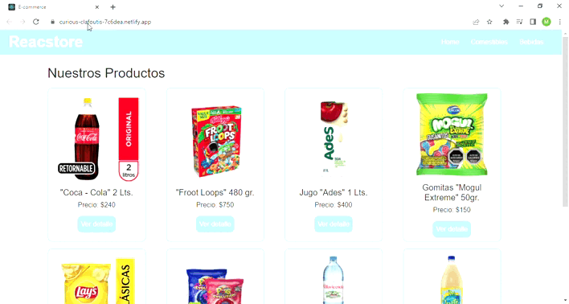

# Reacstore
Reacstore es un simulador de e-commerce, creado principalmente con React Js y sus diferentes funcionalidades o herramientas como react-router, hooks, react-toastify,etc.
Este proyecto además, es mi presentacion de proyecto final para el curso de React Js, en Coderhouse, por esta razón es que el foco principal está puesto en la implementación y el correcto funcionamiento de la Librería y no tanto en los estilos.
## Herramientas utilizadas
****
* Firebase: V.9.6.10
* react: V.17.0.2
* react-bootstrap: V.2.2.2
* react-dom: V.17.0.2
* react-router-dom: V.6.2.2",
* react-scripts:V.5.0.0
* react-toastify: V.8.2.0
* sass: V.1.49.9
## Instrucciones de instalación
***
1. Instalar Node Js.
- [**Descarga de Node Js**](https://nodejs.org/en/descargar/)
2. Descargar npm en la terminal con el siguiente comando:
- **npm install -g npm**
3. Clonar el repositorio en su Pc con el siguiente comando:
- **git clone https://github.com/maximilianosarmiento/cursoReact_sarmiento**
4. Iniciar la App con el siguiente comando:
- **npm start**

*Recuerde instalar las herramientas necesarias para el correcto funcionamiento de la App*
## Instrucciones de Uso
***
1. Navegar por la página principal o filtrar su búsqueda por las distintas categorías en busca de su producto.
2. Seleccione ver el detalle del producto en el que está interesado.
3. Una vez en el detalle, podra guardar en el carrito la cantidad de éste producto que desee.
4. Puede seguir agregando productos a su carrito, o puede dirigirse al carrito para repasar su compra y confirmarla. 
## Demo de proceso de compra
***

